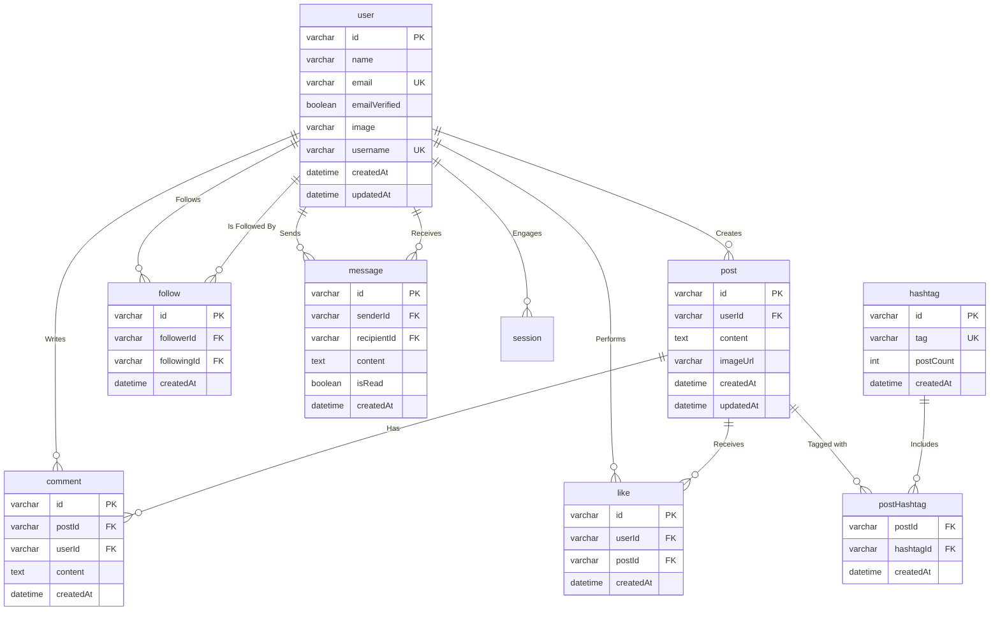

# Database Design Document

## 1. Data Modeling & Database Design

### Overview
The database uses a robust MySQL relational schema structured around users, user sessions, posts, messaging, interactions (likes, comments, follows), and robust event notifications.

### ERD/EER Diagram



### Schemas & Normalization Strategy

**Design Philosophy (NF3):**
The primary tables (`user`, `post`, `comment`, `message`) are fully normalized (Third Normal Form) to prevent modification anomalies. Every column in these tables functionally depends on the primary key. Many-to-many relationships (users following users, users liking posts, hashtags on posts) are explicitly modeled via junction tables (`follow`, `like`, `postHashtag`) ensuring atomic constraint checks (e.g., `UNIQUE(userId, postId)` for likes).

**Targeted Denormalization:**
To maintain high performance at scale, specific aggregates are denormalized:
1. **Hashtag Table (`postCount`)**: Instead of executing `COUNT(*)` across millions of rows in `postHashtag` every time the "Explore/Trending" page loads, the system stores `postCount` inside the `hashtag` table and increments/decrements it via an application hook.
2. **Comment/Like Aggregates (Future):** If post load times deteriorate due to aggregate computations, `viewCount`, `likeCount`, and `commentCount` will be materialized directly on the `post` table.

---

## 2. Database Implementation & Optimization

### The SQL Logic: Core Heavy-Lifting Queries

**1. Home Feed Generation (Subqueries & Joins)**
To fetch a user's chronological feed, we only want posts from people they follow, along with the counts of likes and comments, and whether the _current user_ has liked each post.

```sql
SELECT
    p.*,
    u.name AS authorName,
    u.username AS authorUsername,
    u.image AS authorImage,
    (SELECT COUNT(*) FROM `like` l WHERE l.postId = p.id) AS likeCount,
    (SELECT COUNT(*) FROM comment c WHERE c.postId = p.id) AS commentCount,
    EXISTS(SELECT 1 FROM `like` l WHERE l.postId = p.id AND l.userId = ?) AS isLikedByMe
FROM post p
JOIN user u ON p.userId = u.id
JOIN follow f ON p.userId = f.followingId
WHERE f.followerId = ?
ORDER BY p.createdAt DESC
LIMIT 20 OFFSET ?;
```

**2. Calculating Trending Content (Aggregation & Math)**
To surface "Explore" content, we score posts dynamically based on recent engagement (comments weighted heavier than likes) divided by the time since publication.

```sql
SELECT
    p.id, p.content, p.createdAt,
    COUNT(DISTINCT l.id) AS likes,
    COUNT(DISTINCT c.id) AS comments,
    (COUNT(DISTINCT l.id) + (COUNT(DISTINCT c.id) * 2)) / 
    GREATEST(DATEDIFF(NOW(), p.createdAt), 1) AS engagementScore
FROM post p
LEFT JOIN `like` l ON p.id = l.postId
LEFT JOIN comment c ON p.id = c.postId
WHERE p.createdAt >= DATE_SUB(NOW(), INTERVAL 7 DAY)
GROUP BY p.id
ORDER BY engagementScore DESC
LIMIT 10;
```

### NoSQL Implementation Plan

**Redis Cache Architecture:**
While MySQL acts as the persistent, transactional Store of Record, Redis (NoSQL key-value store) is leveraged for caching dynamic computations that are universally read but frequently expire:
1. **Trending Hashtags:** Results from the hashtag `postCount` queries are cached in Redis with a TTL of 15 minutes (`SET trending:hashtags JSON_BLOB EX 900`).
2. **Session Storage:** Auth session tokens can be mapped in Redis to reduce reads directly hitting the SQL database.
3. **Rate Limiting:** IP-based tracking mechanisms leverage Redis `INCR` to prevent API abuse.

*(If the user messaging volume scales massively, `messages` could be migrated into MongoDB as standalone documents for easier horizontal sharding, allowing the relational DB to solely handle the social graph.)*

### Performance Optimization specifics

**1. Indexing Strategy**
Heavy filtering logic has B-Tree indexes constructed against them:
- `idx_createdAt (createdAt DESC)` on `post` for rapid home feed retrieval without full table scans.
- `idx_userId` on `post` to enable instant rendering of the `Profile` page.
- Composite Unique Indexes: `(followerId, followingId)` on `follow` ensuring foreign key lookups process sequentially.

**2. Connection Pooling**
The backend uses a specialized generic pooling algorithm within Express.js to keep a max amount (e.g., 20) active database connections ready, mitigating the overhead of frequent TCP/IP handshakes during rapid API request spikes.
