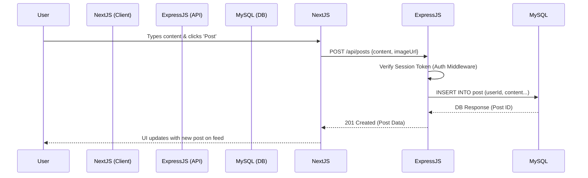
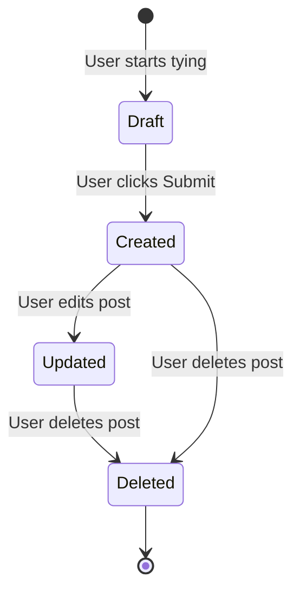

# Product Requirement Document (PRD)

## 1. The Big Picture & Requirements

### The Problem & Value
**Problem:** In the current digital landscape, users often feel disconnected despite being on multiple platforms. Existing networks are becoming overly algorithmic, hiding posts from friends, and prioritizing sponsored content over organic interactions.
**Target Audience:** Young adults, hobbyists, and digital communities looking for chronological, meaningful engagement without algorithmic suppression. 
**Business Value:** By offering a platform returning to core social interactions (chronological feeds, clear trending metrics, direct engagement), the platform can drive high user retention and organic growth. Monetization will come post-MVP through creator tips, verified badges, and ad revenue.

### Scope & MVP (Jobs to be Done)
**Job to be Done:** "When I open the app, I want to see what my friends are doing right now, so I can interact with them and stay connected."
**MVP Scope:** 
- User Authentication (Sign up, Sign in, Session management)
- Profile Management (Bio, Profile picture)
- Post Creation & Feed (Chronological feed of followed users)
- Social Interactions (Like, Comment, Follow)
- Global Search & Discovery (Search users, posts, hashtags)

### User Stories & Acceptance Criteria

**US1: As a user, I want to create a post with text and an image, so that I can share updates.**
- *AC1:* User can enter up to 280 characters of text.
- *AC2:* User can attach one image via URL.
- *AC3:* Post appears immediately on the creator's profile and their followers' home feeds.

**US2: As a user, I want to follow other users, so that their posts appear in my feed.**
- *AC1:* Profile page displays a "Follow" button if not currently following.
- *AC2:* Clicking "Follow" updates the button to "Unfollow" and increments follower count.
- *AC3:* Following a user adds their posts to the chronological home feed.

**US3: As a user, I want to like and comment on posts, so I can engage with content.**
- *AC1:* Clicking the like button toggles the like state and updates the integer count.
- *AC2:* User can submit a text-based comment under a post.
- *AC3:* The post owner receives a real-time notification upon interaction.

### Requirements

**Functional Requirements:**
1. System shall authenticate users via email/password.
2. System shall display a reverse-chronological feed of posts from followed users.
3. System shall allow text searches across users, posts, and hashtags.
4. System shall trigger notifications for likes, comments, and follows.

**Non-Functional Requirements:**
1. **Performance:** The home feed must load within 1.5 seconds under normal load.
2. **Scalability:** The architecture must support horizontal scaling for the backend API.
3. **Security:** Passwords must be hashed using bcrypt/argon2. JWT tokens must be securely stored in HttpOnly cookies.
4. **Reliability:** 99.9% uptime for the core database and API.

---

## 2. User Experience & Flow

### User Journey Maps & Information Architecture
**Navigation Structure:**
- `/` (Home): Chronological feed, Create Post.
- `/explore`: Trending posts, suggested users, trending hashtags.
- `/search`: Multi-category search (Users, Posts, Hashtags).
- `/notifications`: Activity stream (likes, hits, follows, mentions).
- `/messages`: Direct messages hub.
- `/profile/[id]`: User specific posts, follower/following stats.

**User Journey (Onboarding):**
1. User lands on landing page.
2. Clicks "Sign Up".
3. Completes profile (Username, Bio, Picture).
4. Redirected to "Explore" to follow at least 3 users.
5. Home feed unlocks.

---

## 3. Architecture & Logic

### System Basics
- **Client (Frontend):** Next.js 14+ (React), using Tailwind CSS for responsive styling. Server-Side Rendering (SSR) for SEO optimization on public profiles.
- **Server (Backend API):** Node.js with Express.js. RESTful API architecture.
- **Authentication:** Better Auth for session and credential management.
- **Database:** MySQL for relational structured data.

### UML Diagrams

#### Sequence Diagram: API Flow for Post Creation

#### State Transition Diagram: Post Object

---

## 4. QA & Post-Launch

### Testing Strategy
- **Unit Testing:** Jest for testing utility functions and complex database queries (e.g., testing the trending algorithm formula).
- **Integration Testing:** Supertest for API endpoints to ensure correct HTTP responses and middleware execution.
- **End-to-End (E2E):** Playwright/Cypress for critical user flows like sign-up, posting, and messaging.
- CI/CD pipeline triggers all tests on pull requests before merging to `main`.

### Metrics & KPIs
**Success Metrics:**
1. **Daily Active Users (DAU) / Monthly Active Users (MAU):** Core engagement ratio.
2. **Post Creation Rate:** Number of posts created per active user per week.
3. **Interaction Depth:** Average number of likes/comments per session.
4. **Time to First Value (TTFV):** How quickly a new user interactions with the app after signing up.

**Feedback Loop:**
- Integrate in-app "Provide Feedback" modal.
- Track 404 and 500 errors automatically utilizing a logging tool.
