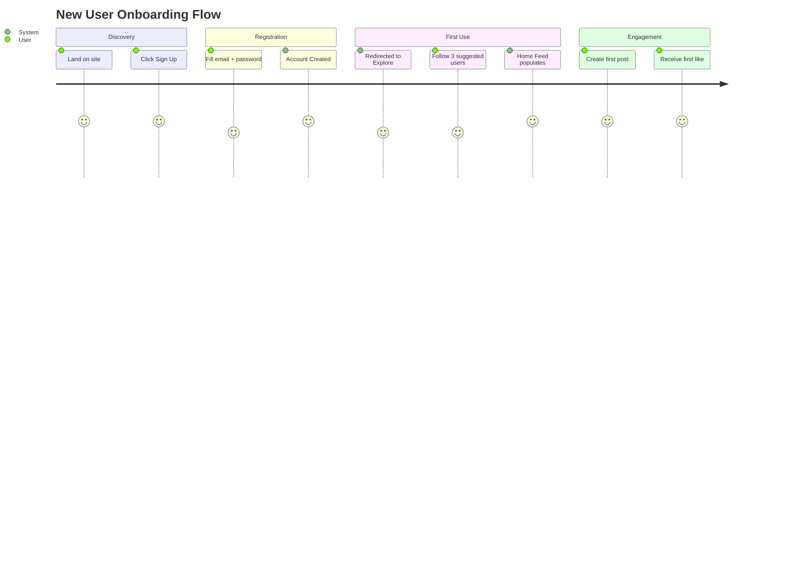
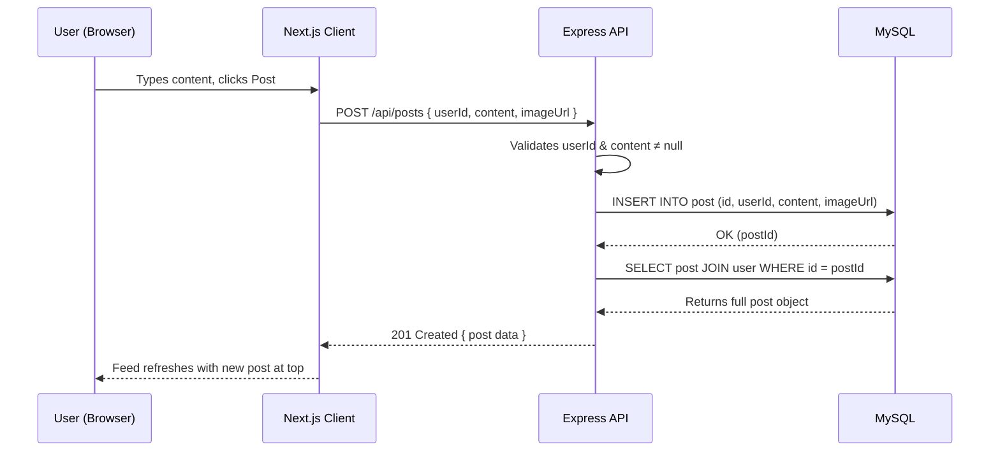
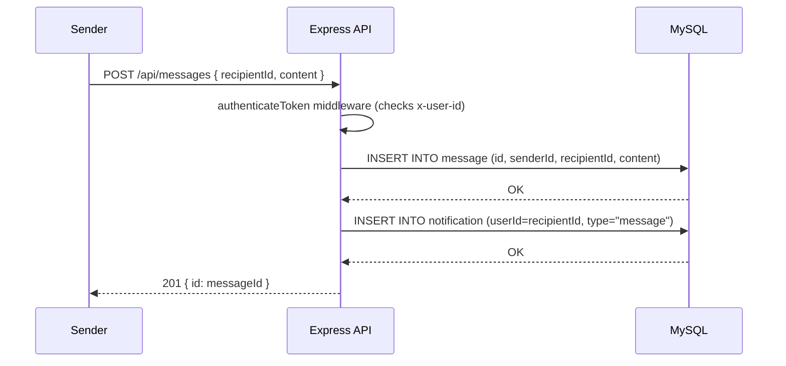
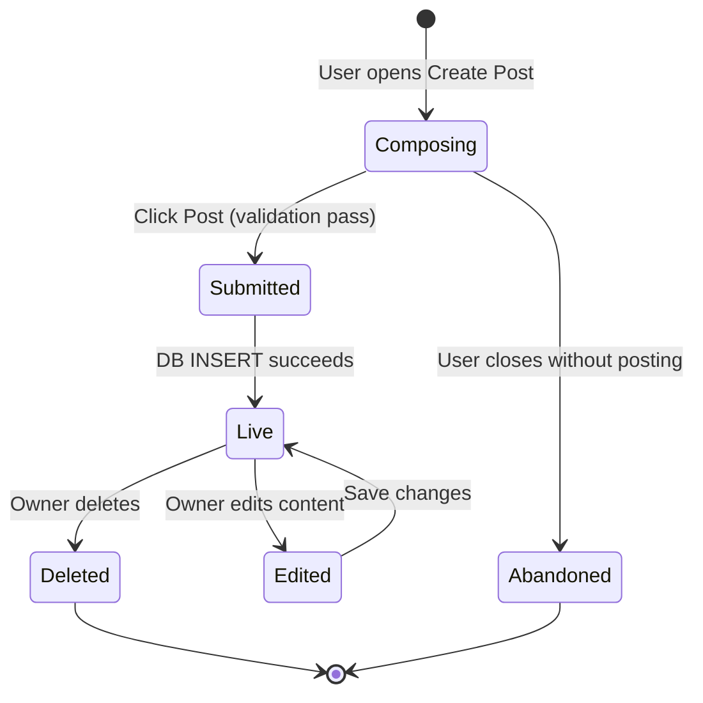
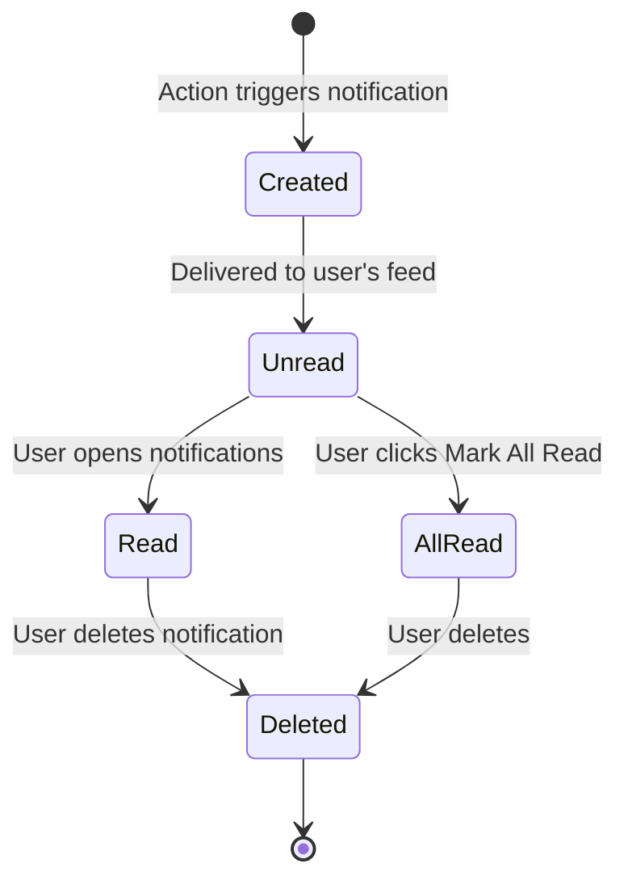

# Social Media Platform — Complete Presentation Summary

> **Project:** Social Media Platform  
> **Classes:** FESE304 (Database Management) + FESE305 (Software App Dev Studio)  
> **Stack:** Next.js · Express.js · MySQL · Better Auth · Docker

---

## 1. 🎯 The Big Picture & Requirements

### Problem & Value
**Problem:** Existing social networks suppress organic content behind opaque algorithms and sponsor prioritization, making users feel disconnected from people they actually follow.

**Solution:** A platform that returns control to users via:
- **Chronological feeds** — see posts in the order they were made
- **Transparent trending** — engagement-based scoring users can understand
- **Private, direct messaging** — first-class DM experience

**Target Users:** Digital-native young adults, hobby communities, micro-influencers  
**Business Model:** Freemium — free access now, creator tips & verified badges for monetization post-launch

### MVP — Jobs to be Done
> *"When I open the app, I want to see what my friends are posting right now, so I can engage and feel connected."*

**MVP Feature Set:**
| Feature | Status |
|---------|--------|
| User Registration & Auth | ✅ Implemented |
| Create / View / Delete Posts | ✅ Implemented |
| Chronological Home Feed | ✅ Implemented |
| Like & Comment on Posts | ✅ Implemented |
| Follow / Unfollow Users | ✅ Implemented |
| Direct Messaging (DMs) | ✅ Implemented |
| Notification System | ✅ Implemented |
| Global Search (Users/Posts/Hashtags) | ✅ Implemented |
| Explore / Trending Discover Page | ✅ Implemented |

### Functional Requirements
1. System shall authenticate users via email/password with secure session handling
2. System shall display a reverse-chronological feed of posts from followed users
3. System shall allow users to like, comment on, and share posts
4. System shall support private direct messaging between any two users
5. System shall trigger in-app notifications for likes, comments, follows, and messages
6. System shall support hashtag discovery and text-based global search

### Non-Functional Requirements
| Requirement | Target |
|-------------|--------|
| Performance | Feed loads in < 1.5s under normal load |
| Security | Passwords hashed; tokens in HttpOnly cookies |
| Scalability | Stateless API supports horizontal scaling |
| Availability | 99.9% uptime via Docker + health check |
| Data Integrity | DB-level constraints (UNIQUE, FK, CASCADE) |

---

## 2. 🖥️ User Experience & Flow

### Information Architecture
```
/                     → Home Feed (posts from followed users)
/explore              → Trending posts + Suggested users + Trending hashtags
/search               → Multi-tab: Users | Posts | Hashtags
/notifications        → Activity stream (likes, comments, follows, DMs)
/messages             → Conversation list
/messages/[userId]    → Chat thread with one user
/profile/[userId]     → User profile, posts, followers
/(auth)/login         → Login page
/(auth)/register      → Registration page
```

### User Journey: New User Onboarding


---

## 3. 🏗️ Architecture & Logic

### System Architecture
```
┌─────────────────────────────────────────────────────────────────┐
│                     CLIENT (Browser)                            │
│              Next.js 14 (React + TypeScript)                    │
│              SSR + CSR · Tailwind CSS                           │
└────────────────────────┬────────────────────────────────────────┘
                         │ HTTP REST (JSON)
                         │ Nginx Reverse Proxy (Docker)
┌────────────────────────▼────────────────────────────────────────┐
│                     SERVER (API)                                │
│              Express.js + TypeScript                            │
│              Better Auth · 9 Route Modules · Port 3001         │
└────────────────────────┬────────────────────────────────────────┘
                         │ MySQL2 Connection Pool
┌────────────────────────▼────────────────────────────────────────┐
│                     DATABASE                                    │
│              MySQL 8.0 (Docker)                                │
│              11 Tables · B-Tree Indexes · FK Constraints        │
└─────────────────────────────────────────────────────────────────┘
```

### Sequence Diagram: Creating a Post


### Sequence Diagram: Sending a DM


### State Transition Diagram: Post Lifecycle


### State Transition Diagram: Notification Lifecycle


---

## 4. 🗄️ Data Modeling & Database Design

### Entity Relationship Overview

| Table | Role | Relationship |
|-------|------|-------------|
| `user` | Core entity | Has many posts, comments, likes, follows |
| `session` | Auth | One-to-many with user |
| `account` | Auth credentials | One-to-many with user |
| `post` | Content | Many-to-one with user |
| `like` | Junction | Many-to-many (user ↔ post) |
| `comment` | Content | Many-to-one with both user and post |
| `follow` | Social graph | Self-referential many-to-many on user |
| `message` | DM content | Many-to-many (user ↔ user) |
| `notification` | Events | Many-to-one with user |
| `hashtag` | Discovery | Many-to-many with post via `postHashtag` |
| `postHashtag` | Junction | Links posts ↔ hashtags |

### Key Relationships
```
user.id ──(1:N)──► post.userId
user.id ──(1:N)──► comment.userId
user.id ──(1:N)──► like.userId
user.id ──(1:N)──► follow.followerId (as follower)
user.id ──(1:N)──► follow.followingId (as followed)
user.id ──(1:N)──► message.senderId
user.id ──(1:N)──► message.recipientId
post.id ──(1:N)──► like.postId
post.id ──(1:N)──► comment.postId
post.id ──(M:N)──► hashtag.id (via postHashtag)
```

### Normalization Decisions

**3NF Compliance (Core Tables):**
- All non-key attributes depend solely on the primary key
- No transitive dependencies exist in `user`, `post`, `comment`, `message`

**Controlled Denormalization:**
- `hashtag.postCount` — denormalized counter to avoid expensive `COUNT(*)` JOINs every page load on Trending/Explore
- Future: `likeCount`, `commentCount` can be materialized on `post` if read performance degrades

### Important DB Constraints
```sql
-- Prevents double-liking
UNIQUE KEY unique_like (userId, postId) ON `like`

-- Prevents duplicate follows
UNIQUE KEY unique_follow (followerId, followingId) ON follow

-- Cascades deletes (orphan prevention)
FOREIGN KEY (userId) REFERENCES user(id) ON DELETE CASCADE
FOREIGN KEY (postId) REFERENCES post(id) ON DELETE CASCADE
```

---

## 5. 🐘 DB Implementation & Optimization

### Core SQL Query — Feed Generation (Joins + Correlated Subquery)
```sql
SELECT
  p.*, u.name, u.username, u.image,
  COUNT(DISTINCT l.id) AS likeCount,
  COUNT(DISTINCT CASE WHEN l.userId = ? THEN 1 END) AS isLiked
FROM post p
JOIN `user` u ON p.userId = u.id
LEFT JOIN `like` l ON p.id = l.postId
GROUP BY p.id
ORDER BY p.createdAt DESC
LIMIT 50;
```

### Core SQL Query — Trending Posts (Engagement Scoring)
```sql
SELECT p.id, p.content,
  (SELECT COUNT(*) FROM `like` WHERE postId = p.id) +
  (SELECT COUNT(*) FROM comment WHERE postId = p.id) * 2 AS engagementScore
FROM post p
JOIN `user` u ON p.userId = u.id
ORDER BY engagementScore DESC
LIMIT 20;
```

### Core SQL Query — Direct Message Conversations (CASE + GROUP BY)
```sql
SELECT DISTINCT
  CASE WHEN senderId = ? THEN recipientId ELSE senderId END as otherUserId,
  u.name, u.username, u.image,
  (SELECT content FROM message m2 
   WHERE (m2.senderId = m.senderId AND m2.recipientId = m.recipientId)
      OR (m2.senderId = m.recipientId AND m2.recipientId = m.senderId)
   ORDER BY m2.createdAt DESC LIMIT 1) as lastMessage
FROM message m
JOIN user u ON u.id = CASE WHEN senderId = ? THEN recipientId ELSE senderId END
WHERE senderId = ? OR recipientId = ?
GROUP BY otherUserId
ORDER BY lastMessageTime DESC;
```

### NoSQL Strategy — Redis Caching Layer (Planned)
| Use Case | Redis Key Pattern | TTL |
|----------|------------------|-----|
| Trending Hashtags | `trending:hashtags` | 15 min |
| User Session Tokens | `session:{userId}` | 7 days |
| Unread Notification Count | `notif:unread:{userId}` | 5 min |
| Rate Limiting (API abuse) | `ratelimit:{ip}` | 1 min |

**Why Redis (not MongoDB)?**  
Redis excels at ephemeral counters and caching — the most expensive repeated reads in this system are trending aggregations and unread counts, which fit perfectly in a key-value TTL model.

### Performance Optimizations Implemented
| Optimization | Tables | Benefit |
|-------------|--------|---------|
| `idx_createdAt DESC` | `post`, `comment`, `notification` | O(log n) ORDER BY instead of full table sort |
| `idx_userId` | `post`, `comment`, `like` | Instant profile page / post lookup |
| `idx_token` | `session` | O(1) session validation per request |
| `UNIQUE(userId, postId)` | `like` | DB-level idempotency enforcement |
| `UNIQUE(followerId, followingId)` | `follow` | Prevents duplicate follow rows |
| Connection Pooling | All | Reuses TCP connections, avoids handshake overhead per request |

---

## 6. 🧪 QA & Post-Launch

### Testing Strategy
| Layer | Tool | What's Covered |
|-------|------|----------------|
| Unit Tests | Jest | DB query helpers, trending algorithm formula, input validation |
| Integration Tests | Supertest | All 38 API endpoints (status codes, response shapes) |
| E2E Tests | Playwright | Sign-up, post creation, follow flow, DM send/receive |
| CI/CD | GitHub Actions | Auto-runs all tests on PRs before merge to main |

### Post-Launch KPIs & Feedback Loop

**Engagement KPIs:**
- **DAU/MAU Ratio** — Target: > 0.4 (healthy engagement)
- **Posts per DAU** — Target: > 1.5 posts/user/week
- **Notification Click-Through Rate** — Target: > 60%
- **Time to First Post (TTFP)** — Target: < 10 minutes after registration
- **DM Response Rate** — Target: > 30% of received messages get replied to

**Feedback Loop:**
1. In-app feedback modal (rating + free text)
2. Server error logging (5xx rates tracked via structured logs)
3. Weekly cohort analysis of retention (D1, D7, D30)

---

## 7. 🚀 Delivery & Technical Stack Summary

| Component | Technology | Reason |
|-----------|-----------|--------|
| Frontend | Next.js 14 (React + TypeScript) | SSR/SSG for SEO, DX with TypeScript |
| Backend | Express.js + TypeScript | Lightweight, flexible, widely adopted |
| Auth | Better Auth | Session + JWT hybrid, built-in OAuth readiness |
| Database | MySQL 8.0 | ACID compliance, strong relational constraints |
| Container | Docker + Docker Compose | Reproducible dev/prod environments |
| Reverse Proxy | Nginx | SSL termination, static file serving |
| Caching (planned) | Redis | Low-latency TTL cache for hot data |

### Infrastructure Diagram (Docker)
```
docker-compose.yml
├── frontend  (Next.js, port 3000)
├── backend   (Express.js, port 3001)
├── db        (MySQL 8.0, port 3306)
└── nginx     (Reverse Proxy, port 80/443)
```

---

**Submitted Documents:**
1. 📄 `PRD.md` — Product Requirement Document
2. 🗄️ `DB_Design.md` — Database Design Document
3. 🔌 `API_Endpoints.md` — Backend API Reference
4. 📊 `PRESENTATION_SUMMARY.md` — This file (Combined Overview)
